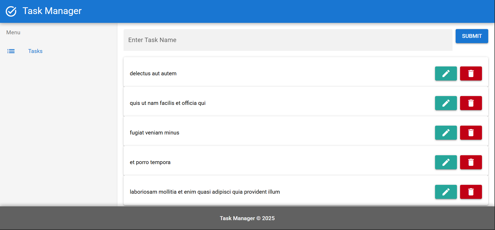

# ✅ Quasar To-Do App (Final Activity)

## A simple CRUD To-Do list built with Quasar Framework and Axios

## 🛠 Requirements

- Node.js and NPM installed
- Quasar CLI installed globally
  ```bash
  npm install -g @quasar/cli
  🚀 How to Run
  ```

1. Clone or download this repository / Or download the zip file
2. Open terminal in the project folder
3. Install dependencies:
   npm install
4. Start the development server:
   quasar dev
5. The app should open at:
   http://localhost:9000

## Functionality

Add a new task using the input field and submit button

View task cards showing title + edit/delete buttons

Edit a task and click the edit icon to update (PUT)

Click the delete icon to remove a task (DELETE)

## API Integration

All tasks are managed through the JSONPlaceholder mock API:
https://jsonplaceholder.typicode.com/todos

Note: The API dont change anything the data will be back after refreshing your browser, its for front end testing only

## Images




<video controls src="./public/video/quasar-to-do-app-demo.mp4" title="Quasar to-do-app demo video"></video>

## Developed by:

Eleaquim Mendevil
GitHub: https://github.com/KooooL-AID
